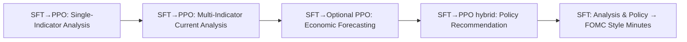

# Training Plan: Economic Analysis, Forecasting, Policy Recommendation, and FOMC Minutes Generation

Version: 20250323


- [Training Plan: Economic Analysis, Forecasting, Policy Recommendation, and FOMC Minutes Generation](#training-plan-economic-analysis-forecasting-policy-recommendation-and-fomc-minutes-generation)
  - [Overview](#overview)
    - [SFT and PPO](#sft-and-ppo)
      - [1. Supervised Fine-Tuning, SFT](#1-supervised-fine-tuning-sft)
      - [2. Proximal Policy Optimization， PPO](#2-proximal-policy-optimization-ppo)
      - [3. SFT + PPO Hybrid](#3-sft--ppo-hybrid)
  - [Stage 1A: Single-Indicator Economic Analysis (SFT → PPO)](#stage-1a-single-indicator-economic-analysis-sft--ppo)
    - [Objective:](#objective)
    - [Training Steps:](#training-steps)
    - [Data Allocation:](#data-allocation)
    - [Data Structure:](#data-structure)
  - [Stage 1B: Multi-Indicator Current Economic or Financial Analysis (SFT -\> PPO)](#stage-1b-multi-indicator-current-economic-or-financial-analysis-sft---ppo)
    - [Objective:](#objective-1)
    - [Training Steps:](#training-steps-1)
    - [Data Allocation:](#data-allocation-1)
    - [Data Structure:](#data-structure-1)
  - [Stage 1C: Economic Forecasting (SFT + PPO hybrid)](#stage-1c-economic-forecasting-sft--ppo-hybrid)
    - [Objective:](#objective-2)
    - [Data Structure Example:](#data-structure-example)
    - [Training Approach:](#training-approach)
    - [Data Allocation:](#data-allocation-2)
    - [Data Structure:](#data-structure-2)
  - [Stage 2: Monetary Policy Recommendation Generation (SFT + PPO hybrid)](#stage-2-monetary-policy-recommendation-generation-sft--ppo-hybrid)
    - [Objective:](#objective-3)
    - [Training Steps:](#training-steps-2)
    - [Data Allocation:](#data-allocation-3)
    - [Data Structure:](#data-structure-3)
  - [Stage 3: Mapping Analysis \& Recommendations to FOMC Minutes Style (SFT)](#stage-3-mapping-analysis--recommendations-to-fomc-minutes-style-sft)
    - [Objective:](#objective-4)
    - [Training Steps:](#training-steps-3)
    - [Recommended Data Ratio:](#recommended-data-ratio)
    - [Data Allocation:](#data-allocation-4)
    - [Data Structure:](#data-structure-4)
  - [Recommended Training Pipeline (Summary)](#recommended-training-pipeline-summary)
  - [Evaluation Metrics](#evaluation-metrics)
  - [Data Resource:](#data-resource)
    - [stage 1 : enhance the analytical ability of the model](#stage-1--enhance-the-analytical-ability-of-the-model)
    - [stage 2: decision-making ability](#stage-2-decision-making-ability)
    - [stage 3: minute writing](#stage-3-minute-writing)
  - [central bank balance sheet](#central-bank-balance-sheet)
  - [government bond repo market](#government-bond-repo-market)
    - [repo](#repo)


## Overview
The revised training pipeline consists of clearly defined stages to gradually develop a language model capable of detailed economic analysis, forecasting, policy recommendation, and generating formal FOMC-style meeting minutes. The updated stages are:

1. **Stage 1A (SFT -> PPO): Single-Indicator Economic or Financial Analysis**
2. **Stage 1B (SFT -> PPO ): Multi-Indicator Current Economic or Financial Analysis**
3. **Stage 1C (SFT + PPO hybrid): Economic or Financial Forecasting based on Current Analysis** 
4. **Stage 2 (SFT + PPO hybrid): Monetary Policy Recommendation Generation**
5. **Stage 3 (SFT): Mapping Economic and Financial Analysis & Policy Recommendations to FOMC Minutes** 

---

### SFT and PPO
#### 1. Supervised Fine-Tuning, SFT
**Definition:**
Train the model to directly imitate expert-generated (or human-generated) data through supervised learning using standard loss functions like cross-entropy.

**Advantages:**
Stable and Predictable
Clearly defined loss (cross-entropy), easy to train, stable convergence.

Simple Implementation
Straightforward to implement and debug; requires only labeled data.

Strong Initial Model Behavior
Produces coherent, human-like outputs from the start.

Clear Learning Objective
Directly learns patterns from expert-written content, easy to evaluate progress.

**Disadvantages:**
Limited Flexibility
Only mimics provided examples; limited capacity to explore or generalize beyond training data.

Quality Dependent on Data
Model quality strictly depends on expert data quality and quantity.

Risk of Overfitting
Tends to memorize specific phrases or styles from training data, potentially limiting creativity or generalization.

#### 2. Proximal Policy Optimization， PPO
**Definition:**
Optimize the model to maximize a reward signal provided by a reward function or model. PPO is policy-gradient-based reinforcement learning designed for stable optimization.

**Advantages:**
Dynamic Optimization
Capable of directly optimizing complex, subjective criteria (logical coherence, quality, decision-making, etc.).

Improves Beyond Expert Data
Can discover better or more optimal outputs than those explicitly demonstrated in supervised data.

Flexible Reward Structure
Easily adjusted reward signals allow the model to adapt dynamically to desired behaviors.

Exploration Capability
Encourages creative and diverse outputs that aren't limited strictly to training examples.

**Disadvantages:**
Training Instability
Higher risk of training instability due to policy-gradient methods (e.g., sudden drops in quality).

High Computational Cost
Requires generating many samples, computing rewards, and multiple passes of policy updates.

Dependency on Reward Model Quality
Model performance is highly sensitive to the quality of the reward model; poor rewards can degrade performance significantly.

Reward Engineering Complexity
Designing a suitable and robust reward function or model is challenging and resource-intensive.

**Reward Function**
Code: [https://github.com/huggingface/trl/blob/main/trl/trainer/grpo_trainer.py]
LLM as Judge: [https://arxiv.org/html/2503.16252v1#A1.SS3]


#### 3. SFT + PPO Hybrid
**Definition:**
Combine supervised fine-tuning (SFT) and PPO simultaneously or sequentially within training, typically through a combined loss function:

Total Loss=PPO Loss+λ×SFT Loss
where λ controls the balance between SFT and PPO.

**Advantages:**
Balanced Training Stability
Supervised signal (SFT) provides a stable anchor, preventing extreme policy divergence due to PPO.

Enhanced Generalization and Optimization
PPO optimizes beyond imitation, enabling the model to improve over original training examples, while SFT ensures the model retains human-like behavior and language quality.

Flexible Control
Easy to control the trade-off between creativity (PPO) and adherence to expert style (SFT) by adjusting λ.

Reduced Risk of Catastrophic Forgetting
Continuously incorporating supervised samples reduces the risk that PPO training overwrites previously learned knowledge or styles.

**Disadvantages:**
Complex Implementation
Balancing two training objectives simultaneously introduces complexity and requires careful hyperparameter tuning.

Higher Computational Resources
Simultaneously calculating PPO and SFT losses increases training complexity and computational overhead.

Challenging Optimization Landscape
Mixed optimization targets (PPO and SFT) might occasionally conflict, causing slower or unstable training if not carefully managed.

Reward Dependency Still Present
Model behavior still relies on the quality of the reward signal, making reward engineering a significant concern.


## Stage 1A: Single-Indicator Economic Analysis (SFT → PPO)
### Objective:
Clearly interpret single economic or financial indicators (e.g., GDP, CPI).

### Training Steps:
- Supervised fine-tuning (SFT): Structured single-indicator economic analyses
- PPO reinforcement: Enhance clarity, economic logic, terminology, and trend interpretation

### Data Allocation:
- **SFT:** 80%
- **PPO:** 20%
- **Previous Stage Data Inclusion:** N/A (initial stage)

### Data Structure:
```json
{
  "messages": [
    {"role": "user", "content": "Current GDP growth is 1.5%. Analyze its economic implications."},
    {"role": "assistant", "content": "The GDP growth rate of 1.5% indicates moderate economic expansion, reflecting slowing momentum possibly due to weakening consumer spending."}
  ]
}
```
---


## Stage 1B: Multi-Indicator Current Economic or Financial Analysis (SFT -> PPO)
### Objective:
Perform comprehensive economic analysis using multiple economic indicators to accurately describe the current economic situation.

### Training Steps:
- Begin from Stage 1A checkpoint
- SFT to establish initial combined reasoning abilities
- PPO (hybrid loss): Strengthen logical integration, coherence, and clarity of combined analysis

### Data Allocation:
- **SFT:** 80%
- **PPO:** 20%
- **Previous Stage Data Inclusion (Stage 1A samples):** 10–15%

### Data Structure:
```json
{
  "messages": [
    {"role": "user", "content": "GDP is 1.5%, CPI is 3.2%, unemployment is 4.0%. Describe current economic conditions."},
    {"role": "assistant", "content": "Current economic conditions show moderate growth coupled with persistently elevated inflation and a relatively tight labor market, indicating ongoing economic pressures."}
  ]
}
```

---


## Stage 1C: Economic Forecasting (SFT + PPO hybrid)
### Objective:
Given the multi-indicator current economic analysis from Stage 1B, forecast future economic conditions clearly and accurately.

### Data Structure Example:
```json
{
  "messages": [
    {
      "role": "user",
      "content": "Current Analysis: GDP growth is 1.2%, inflation is 3.5%, unemployment 4.2%. Predict next quarter's economic outlook."
    },
    {
      "role": "assistant",
      "content": "Economic growth is expected to remain subdued next quarter, inflation may moderately decline but remain above target, and unemployment is projected to slightly increase."
    }
  ]
}
```

### Training Approach:
- Primarily supervised fine-tuning (SFT) with high-quality expert forecasts
- Then PPO for refining forecasting quality based on accuracy, logical coherence, and clarity

### Data Allocation:
- **SFT:** 70%
- **PPO:** 30%
- **Previous Stage Data Inclusion (Stage 1B samples):** 15–20%

### Data Structure:
```json
{
  "messages": [
    {"role": "user", "content": "Current Analysis: Moderate GDP growth, elevated inflation, tight labor market. Predict economic conditions over the next quarter."},
    {"role": "assistant", "content": "In the upcoming quarter, growth is expected to remain modest, inflation may slightly ease but stay above target, and labor market conditions could gradually soften."}
  ]
}
```

---

## Stage 2: Monetary Policy Recommendation Generation (SFT + PPO hybrid)
### Objective:
Generate reasoned monetary policy recommendations based on economic analyses and forecasts.

### Training Steps:
- Load checkpoint from Stage 1C
- SFT for 2–3 epochs on expert-level policy recommendations
- PPO hybrid training:
  ```python
  total_loss = ppo_loss + λ * ce_loss # λ gradually decays from 1.0 to 0.1
  ```
- Reward evaluation: clarity of recommendations, reasoning quality, and institutional tone

### Data Allocation:
- **SFT:** 60%
- **PPO:** 40%
- **Previous Stage Data Inclusion (Stage 1C samples):** 15–20%

### Data Structure:
```json
{
  "messages": [
    {"role": "user", "content": "Economic conditions: moderate growth, persistent inflation, tight labor market. Suggest monetary policy action."},
    {"role": "assistant", "content": "Given persistent inflation and moderate growth, it would be appropriate for the Committee to keep interest rates unchanged while closely monitoring economic indicators."}
  ]
}
```

---

## Stage 3: Mapping Analysis & Recommendations to FOMC Minutes Style (SFT)
### Objective:
Convert previously generated economic analyses and policy recommendations into formal FOMC minutes style.

### Training Steps:
- Input: Outputs from Stages 1B and 2 (economic analysis and policy recommendations)
- Target: Real FOMC minutes excerpts matching the context
- Training method: supervised fine-tuning (SFT)


### Recommended Data Ratio:
- Real FOMC minutes excerpts: 50%-60%
- Automatically generated high-quality samples: 40%-50%

### Data Allocation:
- **SFT:** 100%
- **PPO:** 0%
- **Previous Stage Data Inclusion (Stages 1B & 2 outputs):** 100% (as input)

### Data Structure:
```json
{
  "messages": [
    {"role": "user", "content": "Economic analysis: GDP slowing at 1.2%, elevated CPI at 3.5%, unemployment at 4.2%. Policy recommendation: Keep rates unchanged."},
    {"role": "assistant", "content": "Participants observed moderated GDP growth, persistently elevated inflation, and slight deterioration in labor market conditions, agreeing that maintaining current interest rate levels was appropriate."}
  ]
}
```


---

## Recommended Training Pipeline (Summary)



---

## Evaluation Metrics
| Stage | Metrics |
|-------|---------|
| 1A, 1B | Clarity, accuracy, logical coherence |
| 1C | Prediction accuracy, logic consistency, generalization capability |
| 2 | Clarity and appropriateness of policy recommendations, reasoning quality |
| 2.5 | FOMC style adherence, content coherence, retention of reasoning capability |

---

## Data Resource:

|Names|	Types|	Stage|
|-|-|-|
FOMC books|	Economic and Financial analysis|	Stage 1A、1B、1C |
FOMC minutes|	record|	Stage 2、Stage 3|


-------------------------------
### stage 1 : enhance the analytical ability of the model

### stage 2: decision-making ability

Sample a task prompt
Generate many reasoning traces for the prompt.
Use a verifier to remove reasoning traces with the wrong final answer.
For each remaining trace, extract the set of equations appearing in it. Deduplicate the traces so that each one has a different set of equations. Add those to the dataset.

### stage 3: minute writing


## central bank balance sheet

asset = liability

asset: gold, Repo (secured loans) ** , bond, fx asset (e.g. us t-bill), APF loan ***

"""Asset Purchase Facility (APF) -  a loan from the Bank of England
This is a major monetary policy tool used by the Bank of England to implement quantitative easing (QE). """

QE: buy government bond back, add money supply to the market. 


liability: reserves*** , deposit from government, bank notes**, (digital currency)

off-balance sheet, e.g government owned gold, 


## government bond repo market 

### repo

borrower (bank) <--(cash, sign an agreement to pay back)-- lender (BoE) -- (agreement, receive rate from the cash) --> borrower

the agreement is repo (forward contract)

short term (usually less than a year), highly secured, highly liquid (level A)

If BoE have more cash available --> lower repo rate.


repo market: otc but ccp 
[https://www.icmagroup.org/market-practice-and-regulatory-policy/repo-and-collateral-markets/icma-ercc-publications/frequently-asked-questions-on-repo/3-what-is-the-role-of-repo-in-the-financial-markets/]


repurchase bond (reduce money supply) until target rate (monetary rate) = bank rate (downward sloping demand curve)

after 2008-crisis, ois - gilt < 0: gilt is cheaper than the ois, because of the government default. therefore, the BoE shift to buy gilt back and more to repo market.

after 200-crisis, banks are not allowed to be over leveraged, therefore, the holding position of bond is stable.
But, the hedge funds that are less regulated are the main players in the gilt repo market. 


