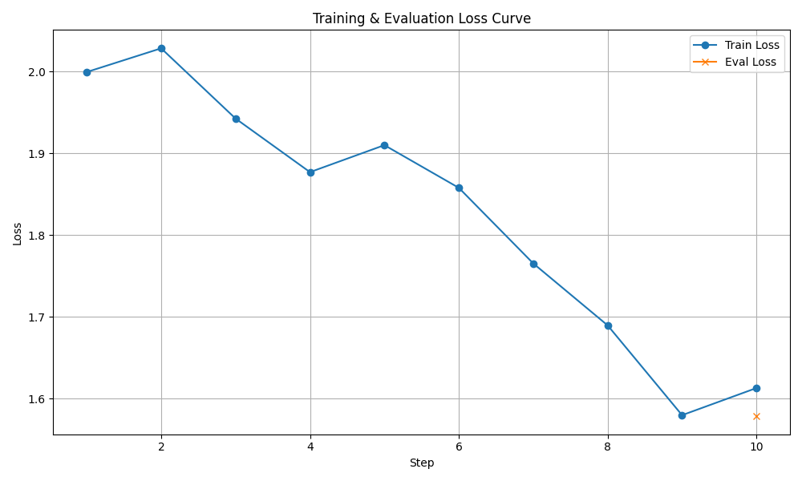

# chk1 新数据集 10-step Smoke Test 退化问题总结

生成时间：2026-08-10 00:30:07 UTC

## 技术结论

使用新 clean candidate 数据集从 chk0 训练 10 个 optimizer steps 后，chk1 smoke adapter **仍然出现灾难性生成退化**。训练数值过程正常，但在与 chk0 完全一致的 held-out test prompt、seed 和采样参数下，新 chk1 输出达到 3,072-token 上限，未生成 EOS、未生成 `</think>`，也没有 final answer；全文和尾部 token 4-gram 重复率分别达到 0.9231 和 0.9647。

该结果已经满足预注册的 fail-fast 条件，因此正式 chk1 训练没有启动。当前配置不得直接进入完整训练。

## 关键证据：训练 loss 正常，但生成已经崩坏

10-step SFT 在两张 A30 上完成，无 OOM、NaN、Inf 或分布式通信错误。训练 loss 从 step 1 的 1.9994 降至 step 10 的 1.6130，最终 eval loss 为 1.5789。

这条曲线只证明优化过程数值稳定，不能证明模型生成行为稳定。本次 smoke 正好展示了仅监控 loss 会漏掉的退化。

| Step | Train loss | Eval loss |
|---:|---:|---:|
| 1 | 1.9994 | — |
| 2 | 2.0284 | — |
| 3 | 1.9425 | — |
| 4 | 1.8770 | — |
| 5 | 1.9100 | — |
| 6 | 1.8578 | — |
| 7 | 1.7654 | — |
| 8 | 1.6896 | — |
| 9 | 1.5798 | — |
| 10 | 1.6130 | 1.5789 |

汇总 train loss 为 1.8263；训练耗时 368.68 秒。完整逐步记录见 `evidence/training/loss_history.jsonl` 和 `evidence/training/trainer_state.json`。

## 同 prompt、同 seed 对照确认新 chk1 发生退化

比较样本为 held-out test 样本 `chk1-analysis-2024-07-31-229179952b21dcd5`。两边使用相同的 822-token prompt、seed `20260809`、`temperature=0.6`、`top_p=0.95` 和 3,072-token completion 上限。

| 指标 | chk0 baseline | chk1 clean-v2 smoke10 |
|---|---:|---:|
| 原始生成 tokens | 374 | **3,072，触顶** |
| 内容 tokens | 373 | **3,072** |
| EOS | 是 | **否** |
| `</think>` 数量 | 1 | **0** |
| 非空 answer | 是 | **否** |
| 输出合同有效 | 是 | **否** |
| 全文 token 4-gram 重复率 | 0.0405 | **0.9231** |
| 尾部 token 4-gram 重复率 | 0.0405 | **0.9647** |

chk0 的完整 8-case baseline 全部有限、全部 EOS 结束、没有触顶、合同有效率 100%、灾难性样本为 0；平均全文重复率为 0.0827，最大值为 0.1425。相比之下，新 chk1 的第一条 matched case 已同时触发：

- `completion_length_cap`
- `full_4gram_repetition_ge_0.50`
- `tail_4gram_repetition_ge_0.60`

因此候选 probe 按 fail-fast 规则在第一条后停止，没有继续消耗 GPU 跑剩余 7 条。这个结果足以否决当前配置，但不能用于估计总体退化发生率。

结果中的 `changed=false` 表示该 test 样本的 target 在 clean-v2 数据修复时没有被改写，不表示模型参数未变化。使用 held-out test 行也意味着它不是 smoke 训练时直接见过的训练样本。

## 数据和训练绑定已核实

运行收据确认本次训练：

- 基座为 `models/DeepSeek-R1-Distill-Llama-8B`，即 chk0。
- 数据为 `chk1_reasoning_compressed_flash_max_v2_clean_20260809_candidate/analysis_sft`。
- 绑定模式为 `chk1_semantic_override`，不是旧 v1 数据。
- 训练上限为 10 steps，学习率为 `5e-5`。
- 本次显式绕过的语义审核授权只允许 chk1 SFT，`downstream_stages_allowed=[]`。

因此当前证据排除了“误用旧数据集”这一解释。它也排除了 OOM、非有限梯度和训练进程提前退出，但不能仅凭一条生成确定退化的唯一因果来源。

## 能确认与不能确认的范围

可以确认：

- 新 clean 数据集修复了已识别的 JSON/evidence-ID 格式污染，但没有阻止当前训练配置在 10 steps 内出现无限重复式退化。
- 训练 loss 与 eval loss 看起来正常，生成门禁仍然失败。
- 相同 prompt/seed 下 chk0 正常而 smoke chk1 崩坏，说明退化在本轮 SFT 更新后出现。

尚不能确认：

- 不能由单条 fail-fast 样本估计退化在全部 prompt 中的比例。
- 不能单独断言根因一定是学习率、LoRA 容量、reasoning 长度或语义审核失败中的某一项。
- 本轮 clean candidate 的 Qwen source-only 语义审核仍未通过；用户授权只允许为 chk1 smoke 绕过，不代表数据已获准用于 chk2、chk3 或 chk4。

## 建议的下一步

1. 不启动当前 `5e-5` 配置的正式 chk1 训练。
2. 从 chk0 创建全新、隔离的 10-step smoke，将学习率降至 `1e-5`，其他数据、seed、LoRA 和生成门禁保持不变，以隔离学习率影响。
3. 若低学习率仍出现相同退化，优先缩短和去冗余 reasoning target，再重新执行基座与 smoke 的 matched-case 对照。
4. 任何候选只有在完整 8-case probe 中无触顶、无灾难重复、均有 `</think>` 和非空 answer 后，才允许启动正式 chk1 训练。
5. 在进入 chk2 以前仍需解决 clean candidate 的语义审核失败；本次 override 不允许向下游传播。

## 证据包说明

本目录的 `evidence/` 保存了本报告使用的只读副本：

- `evidence/config/`：训练 YAML、运行时绑定、candidate manifest、token validation、样本 manifest 和 override 授权。
- `evidence/training/`：完整 trainer state、逐 step loss、train/eval/all results 和 loss 曲线。
- `evidence/chk0_baseline/`：chk0 probe 的 launch、8 条完整结果和 summary。
- `evidence/chk1_smoke/`：新 chk1 probe 的 launch 和首条 fail-fast 结果。
- `evidence/SHA256SUMS`：所有复制证据的 SHA-256 清单。

checkpoint、adapter 权重、optimizer 和 RNG 文件没有复制；它们仍保留在原 smoke 输出目录，避免在 summary 中额外复制约 177 MB 的训练资产。
